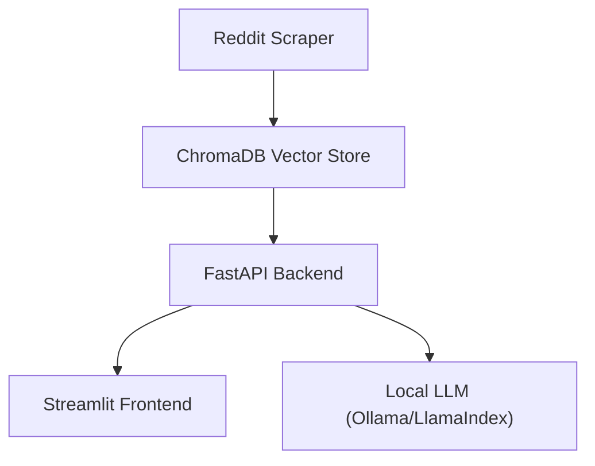

# Ethical-RAG-Scraper

**A local-first, citation-enabled RAG system for ethical knowledge extraction from Reddit.**

---

## Features

- **Local-first:** All data and models run on your machine—no cloud dependencies.
- **Citation-enabled:** Every answer includes source citations for transparency.
- **Ethical scraping:** Only public subreddit data, with respect for Reddit’s API terms.
- **Modular architecture:** Easily extendable to new data sources and models.

---

## Architecture Overview



---

## Technology Stack

- **Python 3.8+**
- **PRAW** (Reddit API)
- **sentence-transformers** (Embeddings)
- **ChromaDB** (Vector database)
- **LlamaIndex** (RAG orchestration)
- **Ollama** (Local LLM)
- **FastAPI** (Backend API)
- **Streamlit** (Frontend UI)
- **Unsloth** (Optional model optimization)

---

## Setup and Installation

1. **Clone the repository:**
   ```bash
   git clone https://github.com/yourusername/Ethical-RAG-Scraper.git
   cd Ethical-RAG-Scraper
   ```
2. **Create a virtual environment:**
   ```bash
   python -m venv .venv
   source .venv/bin/activate  # or .venv\Scripts\activate on Windows
   ```
3. **Install dependencies:**
   ```bash
   pip install -r requirements.txt
   ```
4. **Configure environment variables:**
   - Copy `.env.example` to `.env` and fill in your Reddit API credentials.
5. **Run the application:**
   - Scrape data:
     ```bash
     python data_acquisition/reddit/reddit_scraper.py
     ```
   - Start backend:
     ```bash
     uvicorn api.main:app --reload
     ```
   - Launch frontend:
     ```bash
     streamlit run ui/app.py
     ```

---

## Usage

- **Scrape subreddits:**
  ```bash
  python data_acquisition/reddit/reddit_scraper.py --topic "privacy"
  ```
- **Query the API:**
  Send a POST request to `/query` with your question.

---

## Contributing

We welcome contributions! See [CONTRIBUTING.md](CONTRIBUTING.md) for guidelines.

---

## License

See [LICENSE](LICENSE) for details.
